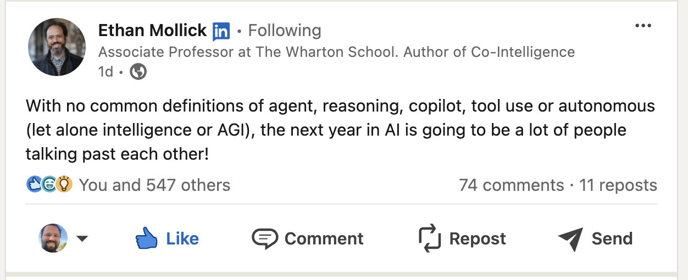

#+TITLE: Using AI Tools for a Personal Assistant

* About Me
#+BEGIN_SRC shell
  $ whoami
  @stevejb - "Stephen J. Barr"
  Chief Evangelist - CloudFix  
#+END_SRC

** Contact

|----------+-------------------------------------------|
| Method   | Contact                                   |
|----------+-------------------------------------------|
| LinkedIn | https://www.linkedin.com/in/stephenjbarr/ |
| YouTube  | https://www.youtube.com/@awsmadeeasy      |
| X        | @stevejb                                  |
| Company  | cloudfix.com                              |
|----------+-------------------------------------------|

* Warning - I usually give a more animated talk
 - Right now I am going to do the best I can.
   Please ignore the wincing and keep me on track if I drift.

 - Weird Al's 1986 classic "Living with a Hernia" is medically accurate.

* AI Personal Assistant Demo

** Links

- https://www.twitch.tv/videos/2243349167
  AWS Twitch with Darko and Rohini

- https://github.com/stephenVertex/build-on-sbct
  AI assistant in Python

- https://github.com/stephenVertex/amplify-sbct-demo
  Backend in Amplify - not much here

* Background - LLM's + Tools
** AI
- LLMs
- ChatGPT, Claude, Llama
- Running these models
  - =Llama.cpp= / Ollama for running models
  - ChatGPT
  - Claude
  - Bedrock!
  
** Ethan Mollick Quote
:PROPERTIES:
:ORG-IMAGE-ACTUAL-WIDTH: 1400
:END:

#+ATTR_ORG: :width 700px

** Tooling
1. LLMs

2. Bedrock

3. Claude

** How do you get LLM's to "do stuff"?
- Tool usage

** More than one way to do this:
- Bedrock Agents + Lambda functions
- Claude Tools
- More generally, Converse API tools
 
   
* What problem am I trying to solve?
- I want to have an EA - can't afford one
- I want to make sure that my calendar and tasks are up to date and managed
- My personal productivity stack is ClickUp. It is similar to Asana, but very automatable.
- It's nice when things have an API

** ASIDE - Claude 3.5 Sonnet "Computer Use"
- *Everything* has an API now.

* Demo Stack

** Backend
- Instead of some proprietary tool, let's use Amplify
- Very simple data model
- https://github.com/stephenVertex/amplify-sbct-demo
- Amplify yields a GraphQL Schema, Endpoint, and API Key
- Go to AWS AppSync and download the schema.json or schema.graphql

** The Amplify part
- Start with the default app
  https://docs.amplify.aws/react/start/quickstart/

- Start with the Github repo https://github.com/new?template_name=amplify-vite-react-template&template_owner=aws-samples&name=amplify-vite-react-template&description=My%20Amplify%20Gen%202%20starter%20application

#+BEGIN_SRC js
  const schema = a.schema({
      Todo: a
	  .model({
	      content: a.string(),
	  })
	  .authorization((allow) => [allow.publicApiKey()]),
      OKR: a.model({
	  title: a.string(),
	  description: a.string(),
      })
	  .authorization((allow) => [allow.publicApiKey()]),
      Task: a
	  .model({
	      name: a.string(),
	      description: a.string(),
	      estimated_time_mins: a.integer(), // Fields are optional by default, but you can make them required
	      priority: a.integer(), // Lets assume 1 to 5, with 1 being the lowest
	      tags: a.string().array(), // This is the proper syntax for making a field into an array,
	      scheduled_date_utc: a.integer(), 
	  })
	  .authorization((allow) => [allow.publicApiKey()]),
#+END_SRC

** Amplify Components
- [[https://us-east-1.console.aws.amazon.com/amplify/apps/d3rrbhoevz481t/overview][Amplify]]
- [[https://us-east-1.console.aws.amazon.com/appsync/home?region=us-east-1#/xhx7ykh3ercytpvu2wqbs7gig4/v1/home][AppSync]]
- CloudFormation  
  

** Frontend
- Go to AppSync, and get the URL and the API key

  #+BEGIN_SRC js
    import { Amplify } from 'aws-amplify';

    Amplify.configure({
      API: {
	GraphQL: {
	  endpoint: 'https://3wwasfc2lvhdhcq4e3vnw5lb4m.appsync-api.us-east-1.amazonaws.com/graphql',
	  region: 'us-east-1',
	  defaultAuthMode: 'apiKey',
	  apiKey: 'da2-cndisyx74verlbpnhb2kfsq6mq'
	}
      }
    });
#+END_SRC
- Use the GraphQL endpoint that we downloaded earlier
- Let's use Artifacts to make a frontend

* AI Tool usage
** sbctcli.py
- AWS Bedrock
- Converse
- Pydantic for object modeling
- How does the tool use work?
  https://claude.site/artifacts/1034abd2-12b2-4d75-b61f-e34c3e77f646

** tl;dr

- Ask a question of Bedrock + Claude using Converse
- If we get text, print it.
- If we get a ToolUseBlock, then run the tool.
- Package the response and as a ToolResult, and send it back to the LLM

** Example flow

- User: "What time is it?"
- LLM: toolUseBlock { function = getCurrentTime, id=abc123 }
- User:
  - My code: "oh we got a toolUseBlock, run it!"
  - toolResult { result = 'Oct 22nd, 6pm', id=abc123 }
- LLM: "The time is Oct 22nd, 6pm"

** Documenting to tools
#+BEGIN_SRC python
  function_io_map = {
      "get_current_datetime": {
	  "input": NullModel,
	  "output": CurrentDateTime,
	  "description": "Returns the current date and time in the US Pacific Time Zone.",
	  "function": get_current_datetime
      },
      # ....
      }
#+END_SRC

** Telling Claude about the tools

#+BEGIN_SRC python
  response = client.converse(
      modelId=MODEL_NAME,
      inferenceConfig={"maxTokens" : 4096 }, 
      toolConfig={ "tools" : tools},
      messages=conversation_history
  )

#+END_SRC

** Evaluating tool calls

#+BEGIN_SRC python
  def process_tool_call(tool_name, tool_input):
      if tool_name not in function_io_map:
	  raise ValueError(f"Unknown tool: {tool_name}")

      func_info = function_io_map[tool_name]
      input_model = func_info['input']
      output_model = func_info['output']
      function = func_info['function']

      try:
	  # Validate and create input object
	  validated_input = input_model(**tool_input)
      except ValidationError as e:
	  return {"error": f"Invalid input: {str(e)}"}

      result = function(validated_input)
      return result

#+END_SRC

** Lets experiment

 - Making a plan
 - Planning based on tasks
 - Combining multiple steps
